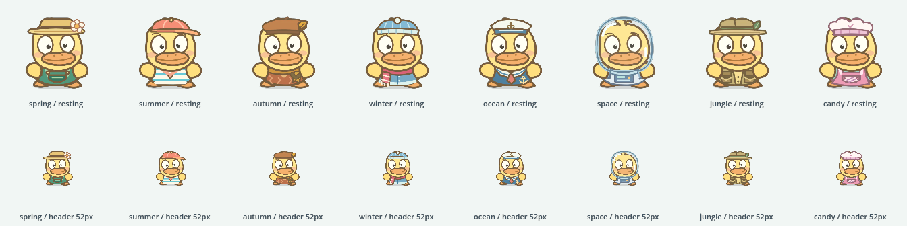

# Jungle, Candy and Pip's wardrobe

Two new worlds extend the existing theme selector: Jungle and Candy. They add
twelve medals and two three-step toys (swing/wave/high-five with a monkey, and
set/frost/decorate a cake). Each world has its own palette, chest effects and
background music. Active medals increase from 36 to 48; all old identifiers,
archived rewards, counts, equipped toys and saved room decorations are retained.

Pip wears a distinct complete outfit in every world: gardener, beach clothes,
autumn knitwear, winter hat/scarf, sailor, astronaut, explorer and pastry chef.
The editable SVG wardrobe generates 24 regular, idle and articulated sheets.
Theme changes preserve speech, dance timing and input bounds. Loading restores
the saved costume before the game starts; the speech companion uses the same art.



The global world controls Pip's clothes. A previously equipped room backdrop
remains equipped independently. Selecting a world never rewrites that decoration.

## Native and asset verification

- Twenty-one relevant Godot suites passed, including new themes (388 assertions),
  the main suite (2,055), medal persistence/migration (1,413), and actual rendered
  outfits (558). Layout, theme controls, reward navigation, old room saves,
  gift lessons, both new toys and Pip's existing activity behavior were covered.
  Age levels (13,461), age controls (102) and adventure selection (2,890) also passed.
- The rendered wardrobe suite compared headwear and clothing in eight worlds,
  preserved facial features, checked 52-pixel silhouettes and exercised speech,
  turns, waving, blinking, three multi-frame dances and reduced motion.
- 102 Node checks passed across assets, export packaging, host bridges, speech
  generation, world audio and reproducible wardrobe generation.
- Web export verified 200 bundled pronunciations and 174 optional resource paths,
  with zero failures. Startup is 14.71 MB, with 87 audio assets loaded on demand.
  The original 295 WAV files were preserved byte for byte.

## Browser verification

Desktop Chromium passed the five theme/wardrobe scenarios:

- All eight themes change the actual rendered Pip in the header and room;
  28 pairwise foreground comparisons exclude background tint as evidence.
- Eight targets fit 320 by 568 pixels without overlap, each at least 52 pixels;
  touch selection and reload preserve the saved theme and rewards.
- Both new toys unlock through a real lesson, a completed Match round and a
  chest opening. Explicit prior-save fixtures supply the first two fragments;
  only the earned third fragment changes. All three toy actions and a reload
  preserve the old medal counts and favorite reward.
- Existing theme switching retains the current game selection and retries a
  failed save in place.

Desktop and iPhone WebKit loading checks passed for both saved new-world costumes.
The existing desktop five-pose dance passed with touch, keyboard and controller input.
Actual header, room, loader, small-screen and toy screenshots were reviewed.

An additional review found that the 4–6 age filter excluded `monkey` and prevented
the Jungle gift lesson from opening. Its real browser regression failed against
the first export. Explicit gift lessons now retain only the requested toy noun
as an age exception; all other words and all ordinary lessons retain age filtering.
Native checks cover all eight gift nouns, mode switching and failed/reset lessons.
Both 4–6 gift flows then passed end to end on desktop Chromium and iPhone WebKit.
iPhone and iPad WebKit also passed small-screen theme selection and saved reload.
The two new medal previews and Memory's themed backs passed; matched Memory
faces remain visible through Peek, mistakes and More in both motion settings.
Final tested game pack: `game-1bc82c04d2c2c900.pck`.

Evidence is under `build/pip-outfits` and `build/voice-pop-qa/wardrobe-*`.
Windows WebKit cannot verify audible output because its AudioContext is absent;
audio claims come from the desktop/native and asset checks.

## Reproduction

```powershell
npm run import
npm run test:themes
node tools/run-godot.cjs --path . --rendering-method gl_compatibility --script res://tests/godot/pip_outfit_tests.gd
npm run build:web
npx playwright test tests/browser/theme-wardrobe.spec.cjs tests/browser/theme-picker.spec.cjs
```
